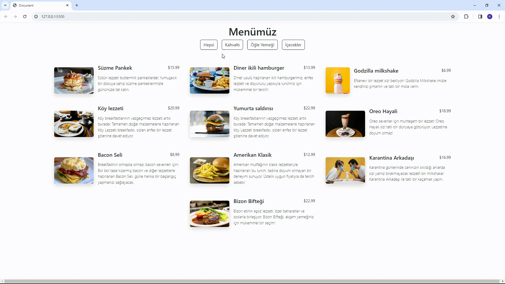

<h1>Menu-Finder-Project</h1>

Özellikler

-Sayfa yüklendiğinde, database.js dosyasından alınan menü öğeleri ekranda gösterilir.

-Her bir menü öğesi, resim, başlık, fiyat ve açıklama içerir.

-Kullanıcılar, "Kahvaltı", "Öğle Yemeği", "Akşam Yemeği" gibi kategorilere göre filtreleme yapabilir.

-"Tümü" butonuna tıklanarak tüm menü öğelerini görüntüleme imkanı sağlanır.

